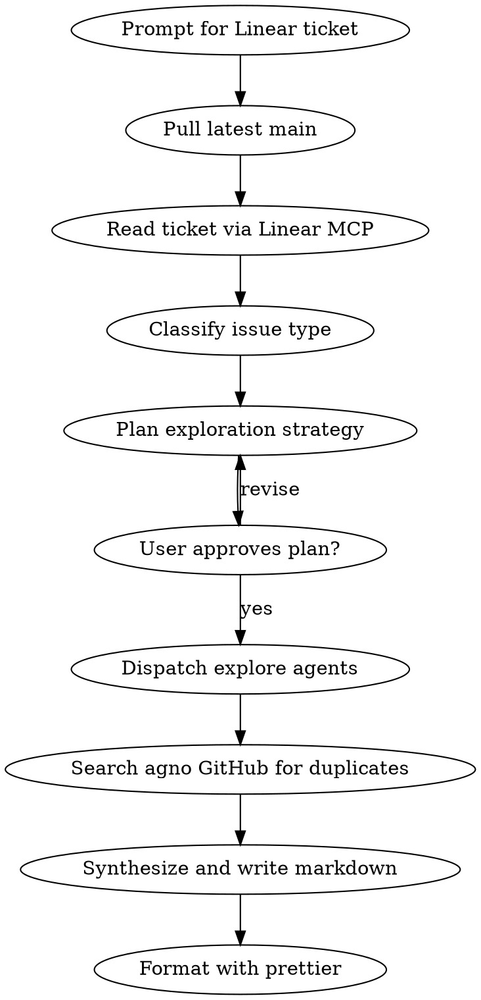

# Agno Issue Explorer

Research the agno codebase and produce a structured GitHub issue document from a Linear ticket. Assumes you are already in the agno source code directory.

## Workflow



### Step 1: Collect Context

Prompt the user for the Linear ticket (ID like `ENG-123` or a full Linear URL).

Pull latest changes before any research:

```bash
git checkout main && git pull origin main
```

Read the ticket using these MCP tools:
- `mcp__linear-server__get_issue` with `includeRelations: true`
- `mcp__linear-server__list_comments` for discussion context

### Step 2: Classify

Determine issue type from ticket content:

| Type | Signals |
|------|---------|
| **Bug Report** | Error reports, unexpected behavior, regressions |
| **Feature Request** | Enhancements, missing capabilities, improvements |
| **Question / Discussion** | Clarifications, architectural or usage questions |

Confirm classification with the user before proceeding.

### Step 3: Plan Exploration Strategy

**This is the most critical step. Spend significant time here.**

Before dispatching any agents:
1. Read the Linear ticket thoroughly — understand what's being asked
2. Identify which agno modules/directories are relevant (agents, tools, workflows, models, knowledge, teams, etc.)
3. Formulate specific research questions that need answering
4. Determine how many explore agents are needed — scale to complexity, don't over-dispatch
5. Assign each agent a clear, non-overlapping research scope

**Present the exploration plan to the user for approval before dispatching.**

### Step 4: Research

Dispatch explore agents using the `Task` tool with `subagent_type: "Explore"`. Run agents in parallel where scopes are independent.

Each agent should return:
- Relevant file paths with line numbers
- Code patterns and implementations found
- Related existing behavior
- Potential impact areas

### Step 5: Check for Duplicates

Search the agno GitHub repo for related issues:
- Use `mcp__github__search_issues` with `q: "<keywords> repo:agno-agi/agno"`
- Note any related open or closed issues

### Step 6: Write Output

Write to `specs/issue-{ticket-number}.md` using the appropriate template.

#### Bug Report

```markdown
# [Title]

## Description

## Steps to Reproduce
1.

## Expected Behavior

## Actual Behavior

## Environment
- OS:
- Python version:
- Agno version:

## Code References

## Related Issues
```

#### Feature Request

```markdown
# [Title]

## Problem Description

## Proposed Solution

## Additional Context

## Related Issues
```

#### Question / Discussion

```markdown
# [Title]

## Question

## Relevant Code

## Related Issues
```

### Step 7: Format with Prettier

After writing the markdown file, format it with prettier:

```bash
npx prettier --write specs/issue-{ticket-number}.md
```

Display the full content to the user for review after formatting.
